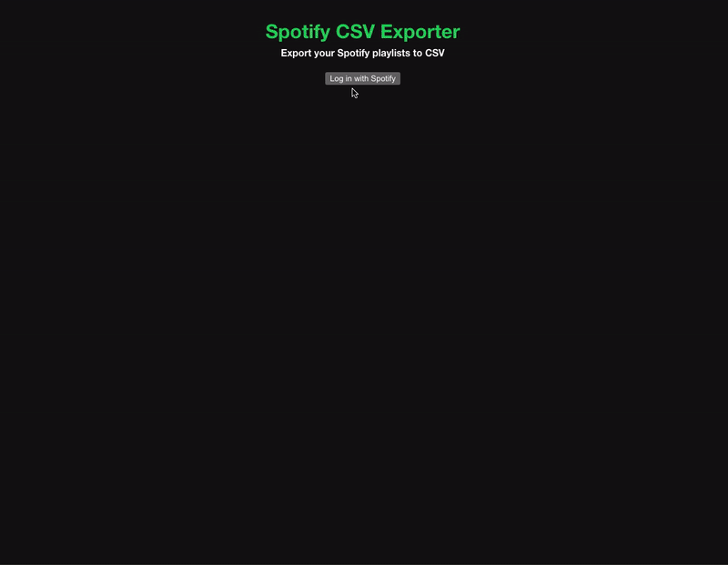

# spotify-csv-exporter
A web application that allows users to export their Spotify playlists to CSV format. It's built with React and utilizes the Spotify Web API and OAuth for playlist data retrieval.

A web application that allows users to export their Spotify playlists to CSV format. Built with React, it leverages the Spotify Web API and implements OAuth 2.0 with Proof Key for Code Exchange (PKCE) for secure authentication. This approach is particularly suited for single-page applications like this one, ensuring enhanced security during the playlist data retrieval process.

## Before you get started  
You will need a Client ID from Spotify. To get a Client ID you need to create a [Spotify App](https://developer.spotify.com/documentation/web-api/concepts/apps) with access to the Web API as your API selection.  

While setting up the app, set the *Redirect URI* to your localhost for local development which should be http://localhost:5173 for this project by default. If deploying, you will need to set the *Redirect URI* to your base URL.

## Setup

- Clone the repository:
  ```
  git clone https://github.com/jwhunt19/spotify-csv-exporter.git
  cd spotify-csv-exporter
  ```

- Install Dependencies:
  ```
  npm install
  ```  

  ### **Local Setup**
  - Create a `.env.local` file at the root & add your environmental variables, replacing [your-client-id] with your Spotify app Client ID:
    
     ```
    VITE_CLIENT_ID=[your-client-id]
    VITE_PUBLIC_URL=http://localhost:5173
    ```
  - Start the development server:
    ```
    npm run dev
    ```
    This will host the application locally at http://localhost:5173
    
  - Navigate to http://localhost:5173 in your browser to use the application

  ### **Deployed Setup** (Using Github Pages)
  - Set up your environment from your repo by navigating to > "Settings" > "Environments" > "New environment". Name the environment *github-pages*.     
  - Create a [Github environment secret](https://docs.github.com/en/actions/security-guides/using-secrets-in-github-actions) named `CLIENT_ID` and set it to the Client ID associated with your Spotify app.
  - Create a [Github environment variable](https://docs.github.com/en/actions/learn-github-actions/variables) named `PUBLIC_URL` and set it your deployed base URL.
  - Ensure the branch from which you wish to deploy is listed in the workflow file (.github/workflows/gh-pages.yml), under on.push.branches. The default is set to the `main` branch.
  - Pushing changes to the specified branch in your repository will automatically trigger the build and deployment process
 
  **Important Notes**:
  - GitHub Pages Setup: The first time you deploy, you may need to set up GitHub Pages in the repository settings. Select the gh-pages branch as the source for GitHub Pages.
  - No Manual Deployment Needed: With this setup, there's no need for manual deployment commands (npm run deploy). The GitHub Actions workflow handles the build and deployment automatically.
  - Initial Branch Setup: You don't need to create the gh-pages branch manually. The GitHub Actions workflow will create and push to this branch on its first successful run.
  - The app will initially only be usable by the Spotify account used to create the Spotify App. You may add up to 25 users in the App settings from the Spotify Dashboard.
  

## Usage
Once the app is running, log in with your Spotify credentials. You'll be able to view your playlists and export them to CSV format.


